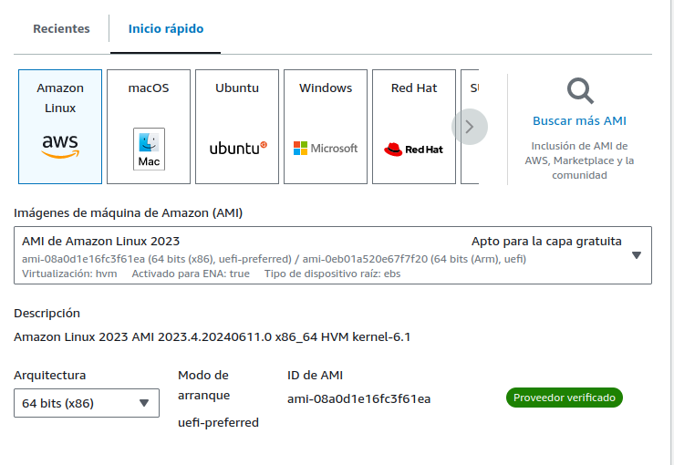
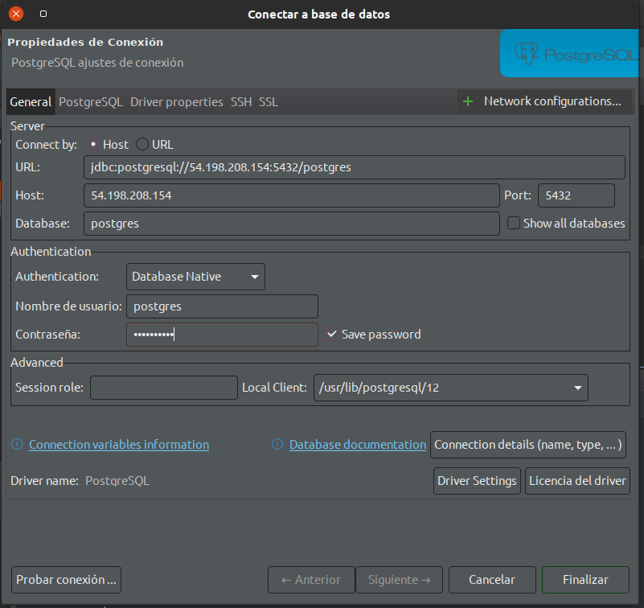

# Creacion de EC2 con conexion externa

### Buscar Servicio
Se busca en la barra  de busqueda  el servicio EC2

En la pagina que se habre buscamos  lanzar la instancia o *launch instance*


En la pagina que se habre ponemos  el nombre del EC2 


Escojemos el tipo de maquina en este caso amazon linux



En tipo de instancia ponemos micro y usamos vockey como par key 


Configuramos la  red , Creamos  un grupo , le damos permitir ssh y las conexiones a internet 


Le damos en lanzar instancia y esperamos que se cree la instancia de EC2


Le damos en ver instancia 


Seleccionamo la que acabamos de crear 


Se nos  abre otra pantalla y le damos conectar 


## Instalar Docker

Lo primero que vamos a hacer es actualizar la maquina con el comando :

``` sudo yum update -y ```

Agregamos el repo de docker a los repo de la maquina virtual con el siguiente Comando :


``` sudo yum-config-manager --add-repo https://download.docker.com/linux/centos/docker-ce.repo```

Y  finalmente le damos el comando para instalar docker 

```sudo yum install docker  ``` 


Validamos la version y que se alla instalado con el comando :

``` docker version ```

## Configurar postgres con docker

Activamos docker para que inicia con nuestro EC2

```sudo systemctl start docker```

```sudo systemctl enable docker```


Configuramos el grupo para que no nos pida root a la hora de iniciar docker 

```sudo usermod -aG docker $USER```

Ejecutamos para validar que todo este bien 

```sudo docker run hello-world```

Luego cerramos la consola y la volvemos abrir para que se apliquen los cambios 

Apenas abra  ejecutamos el siguiente comando con el fin de  correr docker 

```docker run --name mi-postgres -e POSTGRES_PASSWORD=mi_contraseña -v $HOME/docker/postgres_data:/var/lib/postgresql/data -p 5432:5432 -d postgres```

##Configuracion de red de EC2 para peticiones entrantes 


Entramos a id de la instancia 


Vamos a Seguridad y le damos en grupo de seguridad


Le damos en editar reglas de entrada


Vemos las reglas que existen


Agregamos una nueva regla para postgre


Le damos en guardar reglas


Nos saldra una leyenda donde nos dira que las  reglas han sido creadas


## Configuracion de cliente externo

Validamos nuestra ip publica


Vamos a DBbeaver
Y configuramos la conexion con la ip publica y la contraseña que configuramos en docker




Validamos que todo este bien 


Creamos una Bd de prueba


Creamos una tabla de prueba 


``` 
CREATE TABLE books (
    book_id SERIAL PRIMARY KEY,
    title VARCHAR(255) NOT NULL,
    author VARCHAR(255) NOT NULL,
    published_date DATE,
    isbn VARCHAR(13) UNIQUE,
    price NUMERIC(10, 2),
    genre VARCHAR(50),
    stock INT DEFAULT 0
);
```

Validamos de forma visual que este creada 


Nos conectamos a  nuestro docker por consola 
en el EC2 e insertamos  un registro


```docker exec -it mi-postgres psql -U postgres```

Seleccionamos la bd creada

```\c test-aws ```

```
INSERT INTO public.books
(book_id, title, author, published_date, isbn, price, genre, stock)
VALUES (nextval('books_book_id_seq'::regclass), '12122', 'jorge', '2024-02-23', 'col', 54654654, 'F', 15);
```


Validamos de forma visual que este el registro


sudo systemctl start docker
sudo systemctl enable docker


sudo usermod -aG docker $USER

sudo docker run hello-world


docker run --name mi-postgres -e POSTGRES_PASSWORD=mi_contraseña -v $HOME/docker/postgres_data:/var/lib/postgresql/data -p 5432:5432 -d postgres


